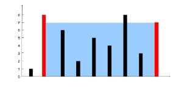

# Lab tasks

1. **Write a program to take a number from the user and add `1` to each digit. Number should be a whole number** \
e.g. Input : `58973`    Output : `69084`

1. **Make a dynamic integer array at run time of user defined input size. Take the array element as input from the user and tell the second highest number.**

1. **Create a program that uses an array of pointers to strings. Allow the user to input several strings, and then display them in reverse order.**

1. **Given an array of integer numbers and an integer target, return indices of the two numbers such that they add up to the target.**\
**You may assume that each input would have exactly one solution, and you may not use the same element twice. You can return the answer in any order.**\
**Input:** nums = `[2,7,11,15]`, target = `9`\
**Output:** `[0,1]`\
**Explanation:** Because `nums[0] + nums[1] == 9`, we return `[0, 1]`.

1. **Write a program that performs a spiral traversal of a 2D array (matrix) using pointers. The program should print the elements in a clockwise spiral order.**\
**Input:**\
`1  2  3  4`\
`5  6  7  8`\
`9 10 11 12`\
`13 14 15 16`\
**Output:**\
`1 2 3 4 8 12 16 15 14 13 9 5 6 7 11 10`

1. **Implement a function that transposes a given 2D array using pointers. The function should modify the original array in-place.**

1. **You are given an integer array height of length `n`. There are `n` vertical lines drawn such that the two endpoints of the `ith` line are `(i, 0)` and `(i, height[i])`.**\
**Find two lines that together with the x-axis form a container, such that the container contains the most water. Return the maximum amount of water a container can store. Notice that you may not slant the container.**
**Input:** height = `[1,8,6,2,5,4,8,3,7]`
**Output:** `49`
**Explanation:** The above vertical lines are represented by array `[1,8,6,2,5,4,8,3,7]`. In this case, the max area of water `(blue section)` the container can contain is `49`.\

